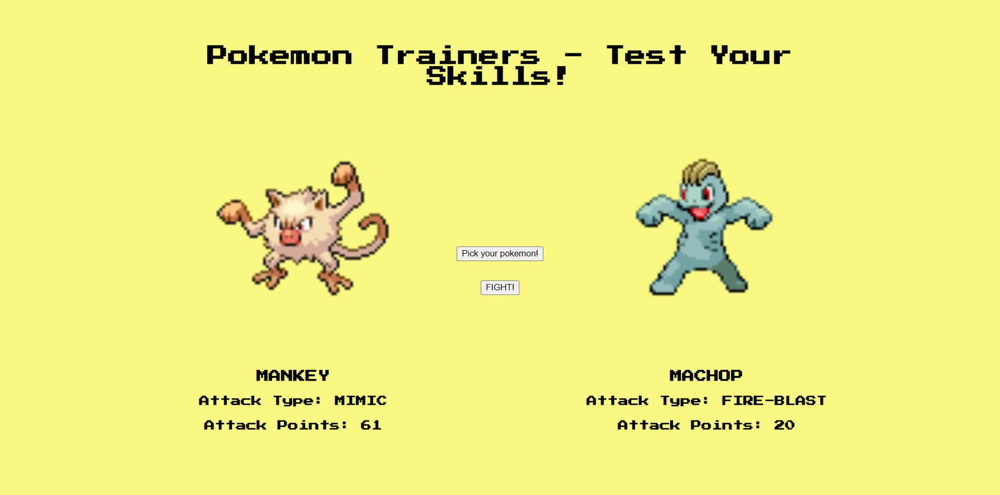

# Hackathon

This week 2 Hackathon focussed on using our newfound skills to make an app that fetched data from a server.

## The Brief

We were given a selection of free to use APIs, and from the documentation, needed to determine how we could use them and access the data returned.

From there, we brainstormed what we could make with our knowledge of JavaScript, the DOM, and the API data.

## The Build



We decided to use the [Pokemon API](https://pokeapi.co/) and create a Pokemon Battle game that would generate selections for two players, determine skills from the API result, and return random score values for each player to 'battle' them. A message then pops up onscreen to tell you which Pokemon won.

The style of the app is intentionally retro, channelling old-school Nintendo DS (and earlier) games.

## Pokemon API

- [Pokemon API](https://pokeapi.co/)

```js
// fetch the first pokemon
fetch("https://pokeapi.co/api/v2/pokemon/1/");
```

## Tech

This app uses:

- HTML
- JavaScript
- CSS

## Contributors

- [@lalicia](https://www.github.com/lalicia)
- [@DevMattDavies](https://www.github.com/DevMattDavies)
